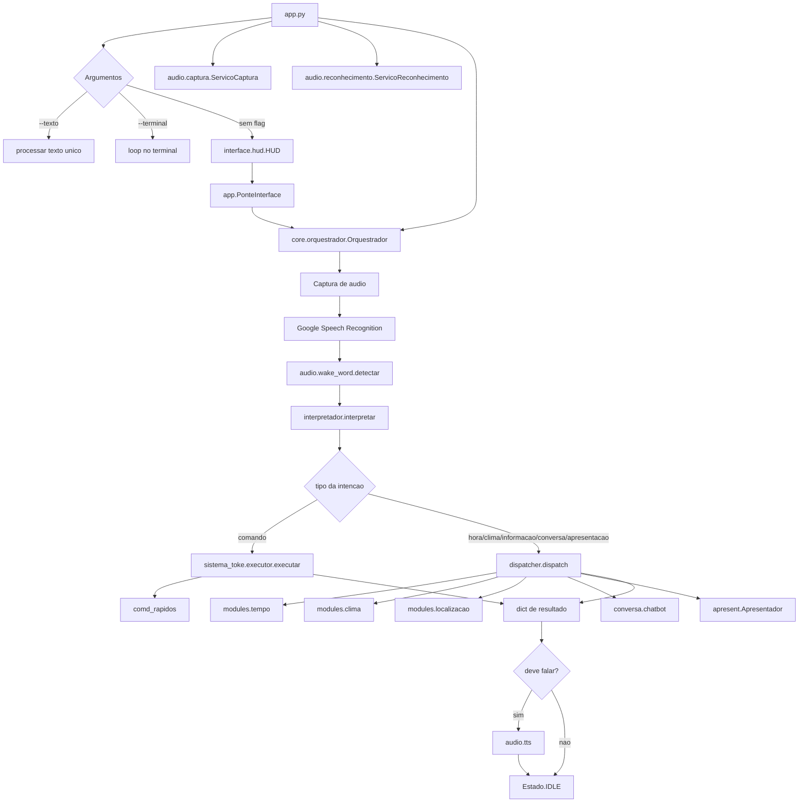
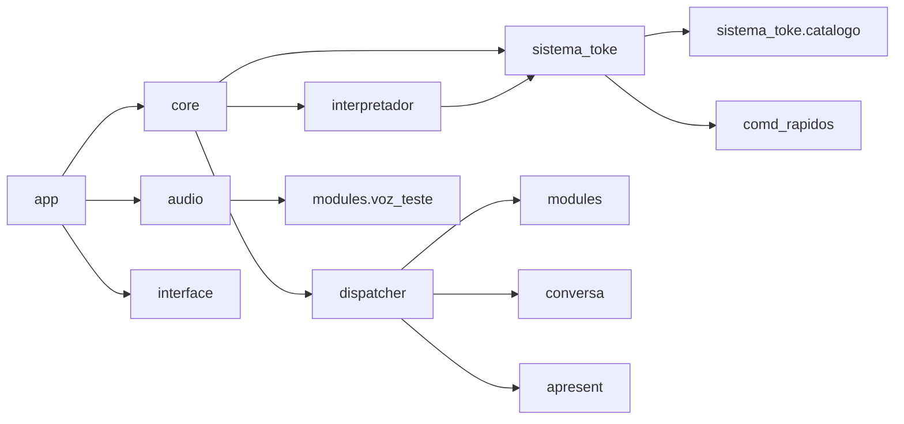

# Arquitetura

O AUTOWORK atual tem uma arquitetura modular, mas nao formalmente separada em pacotes instalaveis. O ponto de entrada principal e `app.py`, que instancia servicos de audio, reconhecimento e orquestracao, e opcionalmente conecta a interface HUD.

## Componentes principais

- `app.py`: ponto de entrada CLI/HUD; configura logging; cria `ServicoCaptura`, `ServicoReconhecimento` e `Orquestrador`.
- `core/`: maquina de estados e orquestrador do fluxo de voz/texto.
- `audio/`: captura de microfone, STT, wake word e fachada TTS.
- `interpretador.py`: roteador deterministico de intencoes; tambem contem uma classe experimental baseada em Ollama.
- `sistema_toke/`: normalizacao, parsing, resolucao e execucao de comandos locais.
- `comd_rapidos/`: implementacoes de acoes locais por `pyautogui` e `webbrowser`.
- `dispatcher.py`: roteia intencoes informativas e de conversa para clima, tempo, localizacao, apresentacao e chatbot.
- `modules/`: modulos informativos, dados locais e TTS experimental.
- `interface/`: saida de terminal e HUD Textual.
- `metricas.py` e `rodar_metricas.py`: observabilidade e benchmarking fora do caminho normal.
- `tests/` e scripts `_test_*.py`: verificacoes unitarias/integracao.

## Fluxo principal

## Camadas reais

### Entrada e interface

`app.py` recebe argumentos CLI. No modo com HUD, cria `interface.hud.HUD`, que roda Textual na thread principal e recebe atualizacoes por `call_from_thread`. A classe `PonteInterface` traduz `core.estados.Estado` para rotulos visuais e normaliza niveis de audio.

### Audio

`audio.captura.ServicoCaptura` usa `speech_recognition.Recognizer` e `Microphone`. A captura pode emitir RMS para a HUD por callback. `audio.reconhecimento.ServicoReconhecimento` chama `recognize_google` em pt-BR. `audio.wake_word.detectar` filtra comandos que nao contem variantes de wake word. `audio.tts` delega a sintese para `modules.voz_teste` e pode emitir envelope de nivel para a HUD.

### Interpretacao

`interpretador.interpretar` e a rota principal usada pelo orquestrador. Ele aplica regras e regex locais para classificar comandos, clima, data/hora, localizacao, apresentacao e conversa. Para comandos locais, ele usa `sistema_toke.parser` e `sistema_toke.resolvedor`.

A classe `InterpretadorComplexo` tambem existe e chama Ollama por HTTP, mas nao e usada pelo fluxo principal de `Orquestrador.processar_comando`; aparece apenas como recurso experimental/medivel em `rodar_metricas.py` quando solicitado.

### Execucao

Comandos locais sao executados por `sistema_toke.executor`, que mantem um registro global `REGISTRO_ACOES`. `Orquestrador.__init__` chama `registrar_comandos_padrao()`, registrando acoes de `comd_rapidos.abrir_app`, `comd_rapidos.abrir_site`, `comd_rapidos.atalhos.Janela` e `comd_rapidos.atalho_nav.AtalhoNav`.

### Informacao e conversa

Intencoes nao locais passam por `dispatcher.dispatch`. Ele chama funcoes de tempo, clima e localizacao, ou inicializa sob demanda `Apresentador` e `Chatbot`. Ambos sao armazenados em variaveis globais privadas para reutilizacao no processo.

## Fluxo de dados

A entrada textual vira um `dict` de intencao. Comandos resolvidos usam `acao` e `parametros`; resultados tambem sao `dict`, normalmente com `status`, `acao`, `mensagem`, `parametros`, `tipo`, `falar`, `sucesso`, `erro` e `dados`, dependendo do modulo.

## Dependencias internas

## Dependencias externas

- Google Speech Recognition via biblioteca `SpeechRecognition`.
- OpenRouter via SDK `openai`.
- Ollama local via HTTP em `http://localhost:11434/api/generate`.
- Nominatim/OpenStreetMap para geocodificacao.
- Open-Meteo para previsao do tempo.
- ip-api.com para localizacao por IP.
- `pyautogui` para automacao local.
- `textual` e `rich` para HUD.
- `kokoro`, `torch`, `sounddevice`, `numpy`, `scipy`, `phonemizer-fork` e eSpeak NG para TTS experimental.
- OpenCV e MediaPipe aparecem em `teste_viso.py`, mas nao estao no `requirements.txt` principal.
